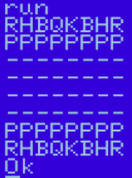

# Basic_Landerman
* Objetivo:
Fazer um código em Basic C64 que printe um tabuleiro de Xadrez.
* Método Utilizado:
Nesse código não criamos um jogo de Xadrez funcional, o objetivo foi simplesmente 
apresentar um formato de tabuleiro do qual se podem fazer melhorias seguintes para
deixá-lo funcional. Utilizamos somente funções simples como "For","Print" e atribuição de valor
para variéveis.
* Simulador utilizado: 
[WebMSX](https://webmsx.org/)
* Imagem:

